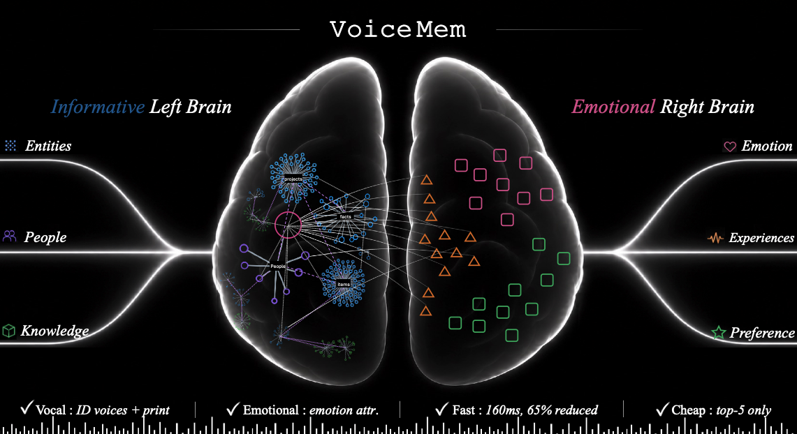
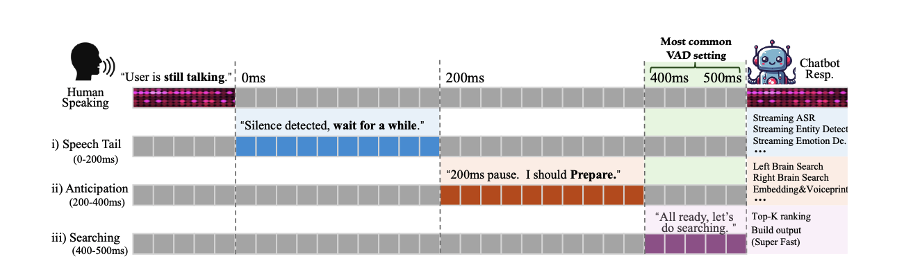
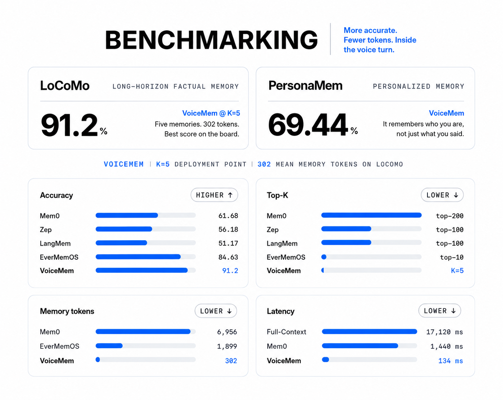

<p align="center">
  
</p>

<p align="center">
  <a href="README.md">[中文]</a> | <strong>[English]</strong>
</p>


<p align="center">
  <a href="https://arxiv.org/abs/2605.19833">Technical Report 📖</a> /
  <a href="https://huggingface.co/datasets/zhifeixie/Voices-in-the-Wild-2M">Voices-in-the-Wild-2M 🤗</a> /
  <a href="https://huggingface.co/zhifeixie/Mega-ASR">Mega-ASR Weights 🤗</a> /
  <a href="https://github.com/xzf-thu/Voices-in-the-Wild-Bench">Voices-in-the-Wild-Bench 🏆</a>
</p>

<p align="center">
  <a href="https://github.com/xzf-thu/Mega-ASR/raw/main/assets/wechat.jpg">
    
  </a>
  <a href="https://xzf-thu.github.io/Mega-ASR/">
    
  </a>
  <a href="https://x.com/XieZhifei14110">
    
  </a>
</p>

---

**VoiceMem** is a memory system for voice models. It adds long-term memory to voice agents so they can better understand a user over time.

VoiceMem uses a **streaming dual-brain architecture**. It provides accurate factual memory, emotional and personality-aware memory, low-latency retrieval, and a lightweight memory context.

* **Left Brain:** Manages factual information and maintains strong retrieval performance even when only Top-3 memories are used.
* **Right Brain:** Manages long-term and short-term emotional information, personality, and relationships. It also connects emotional memory with factual memory from the Left Brain.
* **Low Latency:** Uses compressed information, hierarchical storage, and streaming retrieval with 0–500 ms speculative prefetching, adding very little extra latency.
* **Simple and Practical:** A single query uses about 300 memory tokens. All major components, including the underlying memory engine, are decoupled and can be replaced independently.

<p align="center">
  
</p>

## Demo

> **Note:** Please unmute the video before playback.

<div align="center">
  <video
    src="https://private-user-images.githubusercontent.com/201621992/637588589-34d46638-20db-4943-a88b-b3826c16f156.mp4"
    width="1000"
    controls>
  </video>
</div>

## Overview

* [Quick Start](#quick-start)
* [Architecture](#voicemem-memory-with-streaming-dual-brain-architecture)
* [Features](#features)
* [VoiceMem Model Families](#voicemem-model-families)
* [Voice Chat with Your Own Model](#voice-chat-with-your-own-model)
* [Benchmarking](#benchmarking)
* [Acknowledgements](#acknowledgements)
* [License](#license)

## Quick Start

### Installation

```bash
git clone https://github.com/lang-jiaqi/Voicemem_open.git
cd Voicemem_open

# Memory system installation
pip install voicemem

# Use VoiceMem Model Families
pip install "voicemem[slm]"
```

### Required Model Download

```bash
pip install -U huggingface_hub

hf download zhifeixie/VoiceMem_Default_Models_Env --local-dir ./models
```

### Basic Usage <a id="interfaces"></a>

#### Run as an Offline Memory Engine

```python
from voicemem import VoiceMem

vm = VoiceMem(
    mode="normal",
    openai_key="api_xxx",
    top_k=5,
)

# Store an audio file.
# VoiceMem internally runs ASR, speaker recognition,
# scene and emotion analysis, and embedding extraction.
vm.ingest(audio="input.wav")  # I am vegetarian and allergic to nuts.

result = vm.search("What are my dietary restrictions?")

print(result.result_leftbrain, result.result_rightbrain)


# Store factual text directly without emotional information.
vm = VoiceMem(
    mode="leftbrain_only",
    openai_key="api_xxx",
    top_k=5,
)

vm.ingest("I am vegetarian and allergic to nuts.")

result = vm.search("What are my dietary restrictions?")
```

#### Run VoiceMem in Streaming Mode

VoiceMem can also process audio continuously. You can use the streaming interface in a similar way to a VAD-based audio pipeline.

```python
import asyncio
from pprint import pprint

import numpy as np
import soundfile as sf


async def main():
    audio, sr = sf.read("speech.wav", dtype="float32")
    pcm = (np.clip(audio, -1, 1) * 32767).astype(np.int16)

    stream = vm.stream(
        src_rate=sr,
        vad_threshold=0.5,
        on_partial=lambda t: print(f"\r[partial] {t}", end="", flush=True),
    )

    step = int(sr * .032)

    for i in range(0, len(pcm), step):
        st = await stream.feed(pcm[i:i + step].tobytes())
        print(f"\n[state] {st.state}")

        FIELDS = [
            "result_leftbrain",
            "result_rightbrain",
            "speaker_id",
            "speaker_voiceprint",
            "emotion",
            "transcript",
            "entity",
            "schema",
            "text_embedding",
        ]

        if st.state == "turn_over":
            pprint({key: getattr(st, key) for key in FIELDS})


asyncio.run(main())
```

### Interactive Demo with VoiceMem

```bash
python web/run.py
```

Then open:

```text
http://localhost:8787
```

## VoiceMem: Memory with Streaming Dual-Brain Architecture

**VoiceMem** is a memory system built for real-time voice agents.

Instead of storing every type of memory in a single retrieval database, VoiceMem separates memory into two complementary parts:

<p align="center">
  
</p>

* **Left Brain** organizes factual memory using schemas and entities for precise retrieval.
* **Right Brain** manages personality, emotion, and relationships through independent and cross-entity memory nodes.

<p align="center">
  
</p>

The entire pipeline is **streaming**.

While the user is speaking, VoiceMem can continuously segment audio, transcribe speech, extract useful memory, and write structured information into the memory graph.

At query time, VoiceMem **routes first, ranks second, and injects only the Top-K memories** into the model context. This keeps the memory context small while retaining relevant information.

### Features

* 🎯 **Accurate** — Get **91.2% on LoCoMo**, vs. **61.68% for Mem0**, with only **Top-5** memories.
* ❤️ **Emotional & Personal** — Remember **who the user is and how they feel**, not just what they said. Reach **69.44% on PersonaMem**.
* 🎧 **Multimodal** — Remember **speech, speakers, sound events, multi-speaker conversations, and music** from real-world audio.
* ⚡ **Fast** — Respond in **134 ms**, vs. **1,440 ms for Mem0**, with streaming retrieval inside the voice turn.
* 💰 **Cheap** — Use only **302 memory tokens**, vs. **6,956 for Mem0** and **1,899 for EverMemOS**.

### VoiceMem Model Families

We build **ChatMem-400K** through a three-stage pipeline:

1. **Memory-world construction**
2. **SLM-validated online on-policy distillation (OPD)**
3. **Human refinement**

The same pipeline produces **ChatMem-Bench** for evaluation.

Our models, including **Qwen2.5-Omni, Qwen3-Omni, and Step-Audio2-Mini**, learn to proactively invoke VoiceMem when memory is useful.

<p align="center">
  
</p>

## Voice Chat with Your Own Model

You can connect VoiceMem to your own fine-tuned model for real-time voice conversations.

The basic flow is:

**microphone → VoiceMem listens and prefetches relevant memories → your model responds with those memories in context**

```bash
pip install funasr sounddevice transformers peft torch

export OPENAI_API_KEY=sk-...
# Only used for fact extraction when writing memories.
# Memory retrieval runs entirely locally.

python examples/04_voice_agent_own_model.py
```

### Train Your Own Adapter

The default training configuration matches the one used for the released `checkpoint-3318`.

Running the command below with the default settings reproduces the same adapter:

```bash
pip install -e ".[finetune]"

python finetune/train.py --data data/train.jsonl
```

See **[finetune/README.md](finetune/README.md)** for the training data format, GPU memory requirements, and instructions for using a different base model.

## Benchmarking

The evaluation pipeline is fully open source and reproducible.

<p align="center">
  
</p>

### Evaluation

Run a benchmark with a single command:

```bash
export OPENAI_API_KEY=sk-...

# Start with the small example included in the repository
# to make sure everything is set up correctly.
# 2 conversations, 5 questions.
python evaluation/run.py \
    --dataset locomo \
    --data evaluation/examples/locomo_sample.json

# Then run the full dataset.
python evaluation/run.py \
    --dataset locomo \
    --data data/locomo.json
```

Example result:

```text
LoCoMo: 10 conversations · 152 questions

Score: 139/152 = 91.4%

  multi_hop     88.2%
  temporal      85.7%
  single_hop    95.1%

Median retrieval latency: 12 ms
Median retrieved memory: 298 tokens
```

Before running a full evaluation, you can add `--inspect` to check how the dataset is parsed.

This does not call the model or incur any API cost:

```bash
python evaluation/run.py \
    --dataset locomo \
    --data data/locomo.json \
    --inspect
```

During evaluation, the answering model receives **only the retrieved memories**, not the original conversation history.

Giving the model the full conversation would turn the benchmark into a reading-comprehension task rather than an evaluation of the memory system itself.

See **[evaluation/README.md](evaluation/README.md)** for the full evaluation protocol and instructions for adding a new benchmark. Adding a benchmark only requires one file and two functions.

## Acknowledgements

VoiceMem builds on several excellent open-source projects:

* [mem0](https://github.com/mem0ai/mem0) — vector memory engine
* [FunASR](https://github.com/modelscope/FunASR) — streaming ASR with `paraformer-zh-streaming`
* [sherpa-onnx](https://github.com/k2-fsa/sherpa-onnx) — Silero VAD, 3D-Speaker speaker verification, and fallback streaming ASR
* [intfloat/multilingual-e5](https://huggingface.co/intfloat/multilingual-e5-small) — local embeddings and slot classification

VoiceMem also uses OpenAI APIs for chat, TTS, and Realtime functionality.

## License

VoiceMem is open source under the **Apache License 2.0**.

See [LICENSE](LICENSE) for details.
